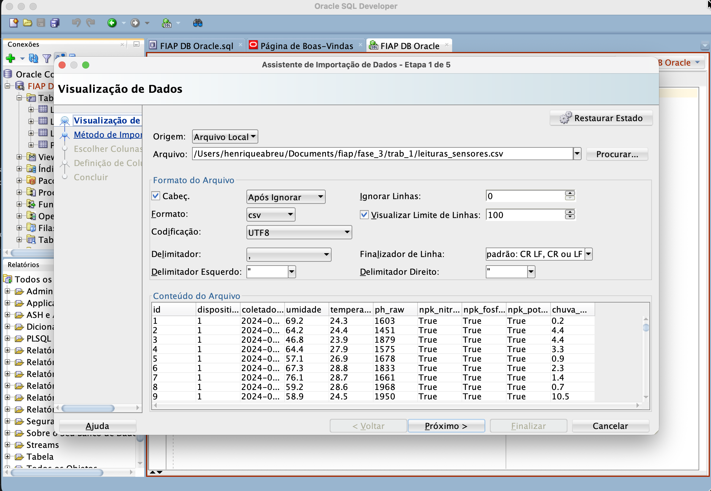
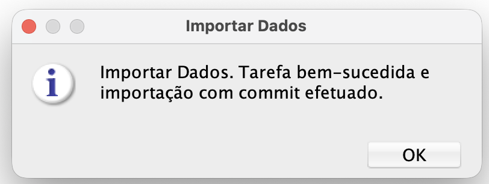
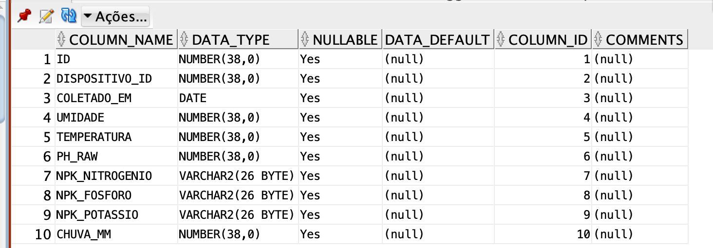
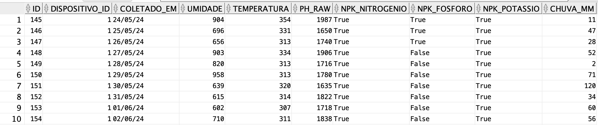
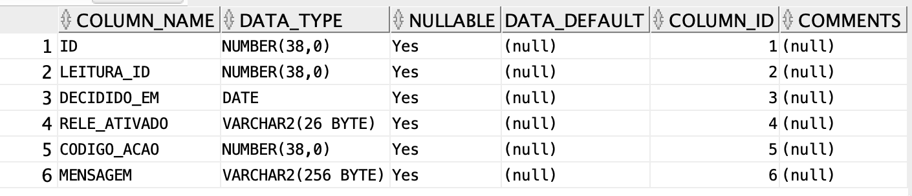
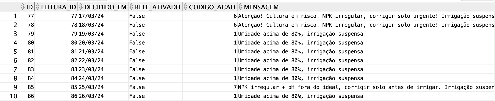
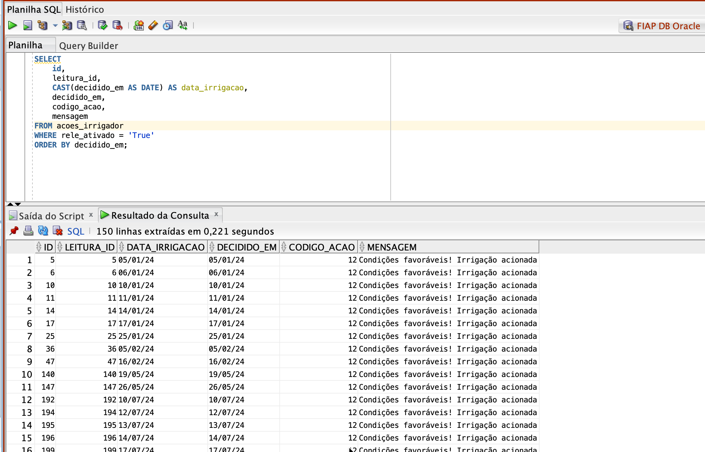
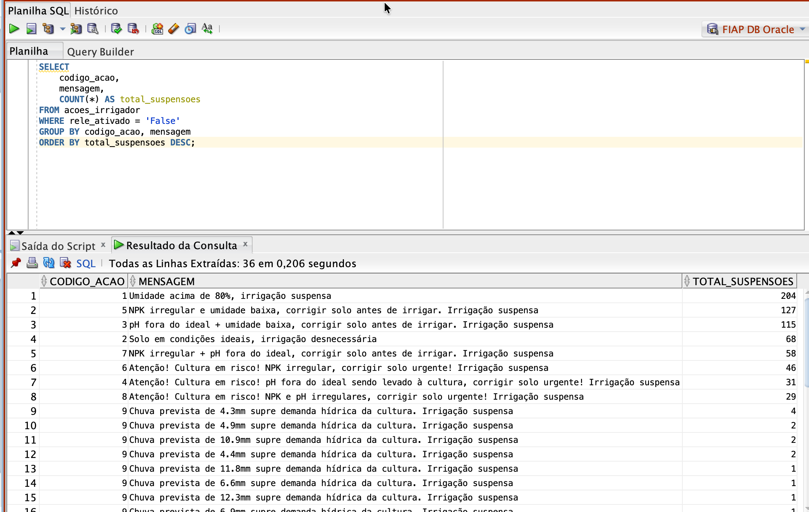
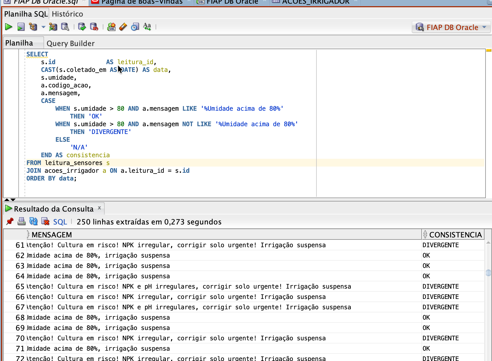

# FIAP - Faculdade de Informática e Administração Paulista

<p align="center">
<a href= "https://www.fiap.com.br/"></a>
</p>

<br>

# Importação e consulta de dados - Oracle SQL Developer

## Nome do grupo

## 👨‍🎓 Integrantes: 
- <a href="https://www.linkedin.com/in/henrique-abreu-95044555/">Henrique Abreu</a>

## Link do vídeo do trabalho 
https://youtu.be/vH4Vfy3NjXk

## 👩‍🏫 Professores:
### Tutor(a) 
- <a href="https://www.linkedin.com/company/inova-fusca">Andre Godoi</a>
### Coordenador(a)
- <a href="https://www.linkedin.com/in/sabrina-otoni-22525519b/">Sabrina Otoni</a>


## 📋 Descrição

## i. Gerando dados

Como os sensores da fase dois geraram poucos dados, decidi usar a ajuda do Claude para gerar dados factíveis:

- Os dados representam as leituras e deciões dos sensores
- Compreendem ao período de janeiro de 2024 à maio de 2026
- A períodicidade de coleta simulada foi de 1x / dia
- A base foi dividida em duas 
    - i. Leituras - KPIS dos sensores 
    - ii.Açoes Irrigação - Comando enviado ao rele

Os dados também estão prsentes em formato CSV no repositório. 

## ii. Importando dados no banco

### Importando as leituras dos sensores:



Dados importados com sucesso: 



Descrição da tabela: 



Dados da tabela (head 10):



### Importando dados das ações dos irridaroes: 

Descrição da tabela: 



Dados da tabela (head 10)


## iii. Consultando dados:

### Consulta i.: Lista dos dias que o irrigador foi acionado: 

##### Query: 
```sql
SELECT
    id,
    leitura_id,
    CAST(decidido_em AS DATE) AS data_irrigacao,
    decidido_em,
    codigo_acao,
    mensagem
FROM acoes_irrigador
WHERE rele_ativado = 'True'
ORDER BY decidido_em;
```



### Consulta ii. Quantas vezes cada motivo suspendeu o acionamento do irrigador: 

#### Query
 ```sql
 SELECT
    codigo_acao,
    mensagem,
    COUNT(*) AS total_suspensoes
FROM acoes_irrigador
WHERE rele_ativado = 'False'
GROUP BY codigo_acao, mensagem
ORDER BY total_suspensoes DESC;
 ```



### Consulta iii.: Será que o meu sensor está avisando corretamente quando a umidade está acima dos 80%?

#### Query

```sql
SELECT
    s.id              AS leitura_id,
    CAST(s.coletado_em AS DATE) AS data,
    s.umidade,
    a.codigo_acao,
    a.mensagem,
    CASE
        WHEN s.umidade > 80 AND a.mensagem LIKE '%Umidade acima de 80%'
            THEN 'OK'
        WHEN s.umidade > 80 AND a.mensagem NOT LIKE '%Umidade acima de 80%'
            THEN 'DIVERGENTE'
        ELSE
            'N/A'
    END AS consistencia
FROM leitura_sensores s
JOIN acoes_irrigador a ON a.leitura_id = s.id
ORDER BY data;
```



Podemos notar que em alguns casos há inconsistência, mas tudo bem, isso é esperado pois na lógica que criamos (consultar aqui) só o aviso mais relevante na orderm de hierárquia é exibido. 


## iv. Conclusão 

Podemos concluir que as bases foram importadas com sucesso no banco de dados e que as consultas estão funcionando como deveram. A chave ```s.id ``` funcionou adequadamente chave entre as duas bases. 


## 📁 Estrutura de pastas

Dentre os arquivos e pastas presentes na raiz do projeto, definem-se:

- <b>.github</b>: Nesta pasta ficarão os arquivos de configuração específicos do GitHub que ajudam a gerenciar e automatizar processos no repositório.

- <b>assets</b>: aqui estão os arquivos relacionados a elementos não-estruturados deste repositório, como imagens.

- <b>config</b>: Posicione aqui arquivos de configuração que são usados para definir parâmetros e ajustes do projeto.

- <b>document</b>: aqui estão todos os documentos do projeto que as atividades poderão pedir. Na subpasta "other", adicione documentos complementares e menos importantes.

- <b>scripts</b>: Posicione aqui scripts auxiliares para tarefas específicas do seu projeto. Exemplo: deploy, migrações de banco de dados, backups.

- <b>src</b>: Todo o código fonte criado para o desenvolvimento do projeto ao longo das 7 fases.

- <b>README.md</b>: arquivo que serve como guia e explicação geral sobre o projeto (o mesmo que você está lendo agora).

## 🔧 Como executar o código

*Acrescentar as informações necessárias sobre pré-requisitos (IDEs, serviços, bibliotecas etc.) e instalação básica do projeto, descrevendo eventuais versões utilizadas. Colocar um passo a passo de como o leitor pode baixar o seu código e executá-lo a partir de sua máquina ou seu repositório. Considere a explicação organizada em fase.*


## 📋 Histórico de lançamentos


    * 
* 0.1.0 - 19/05/2026
    *

## 📋 Licença

<p xmlns:cc="http://creativecommons.org/ns#" xmlns:dct="http://purl.org/dc/terms/"><a property="dct:title" rel="cc:attributionURL" href="https://github.com/agodoi/template">MODELO GIT FIAP</a> por <a rel="cc:attributionURL dct:creator" property="cc:attributionName" href="https://fiap.com.br">Fiap</a> está licenciado sobre <a href="http://creativecommons.org/licenses/by/4.0/?ref=chooser-v1" target="_blank" rel="license noopener noreferrer" style="display:inline-block;">Attribution 4.0 International</a>.</p>
